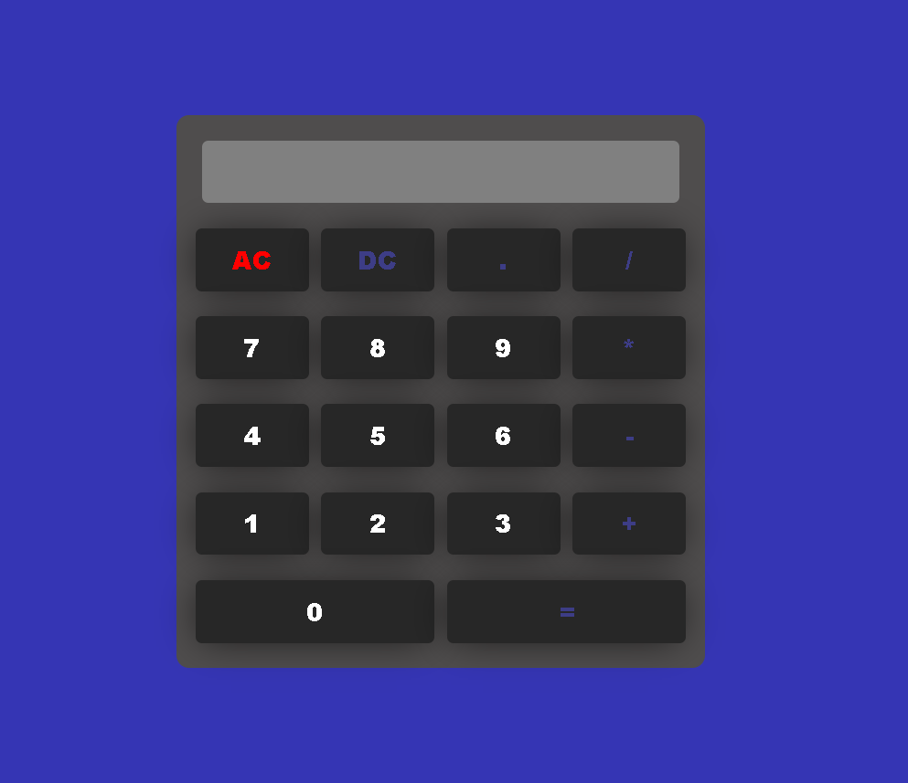

# Calculadora web con JS
Calculadora web sencilla hecha con html, css y js.

## Características
- **Operaciones que realiza:**
    - Suma.
    - Resta.
    - Multiplicación.
    - División.
- Interfaz hecha con **CSS**.

## Tecnologías utilizadas
- <i class="fas fa-laptop"></i> CSS3
- <i class="fab fa-html5"></i> HTML5
- <i class="fab fa-js"></i> JAVASCRIPT